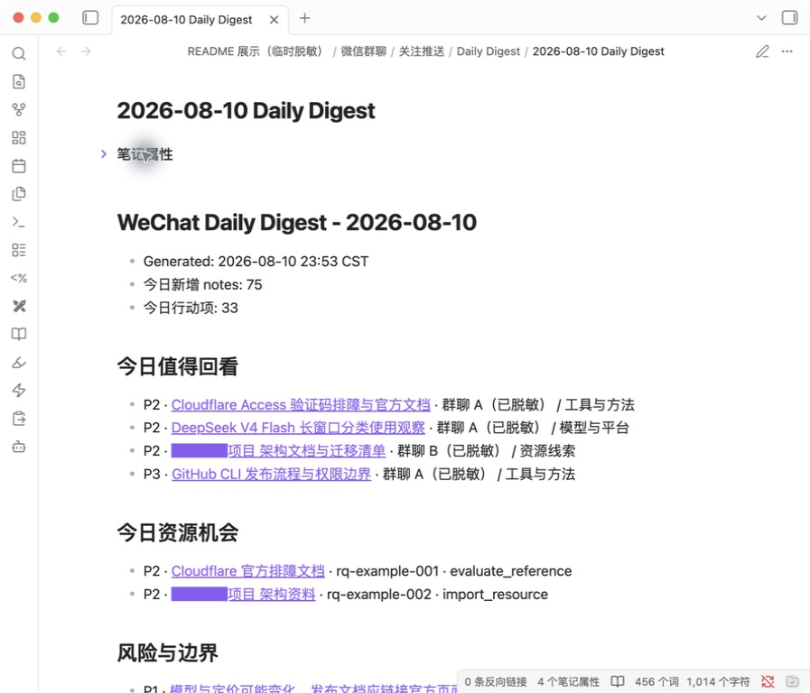
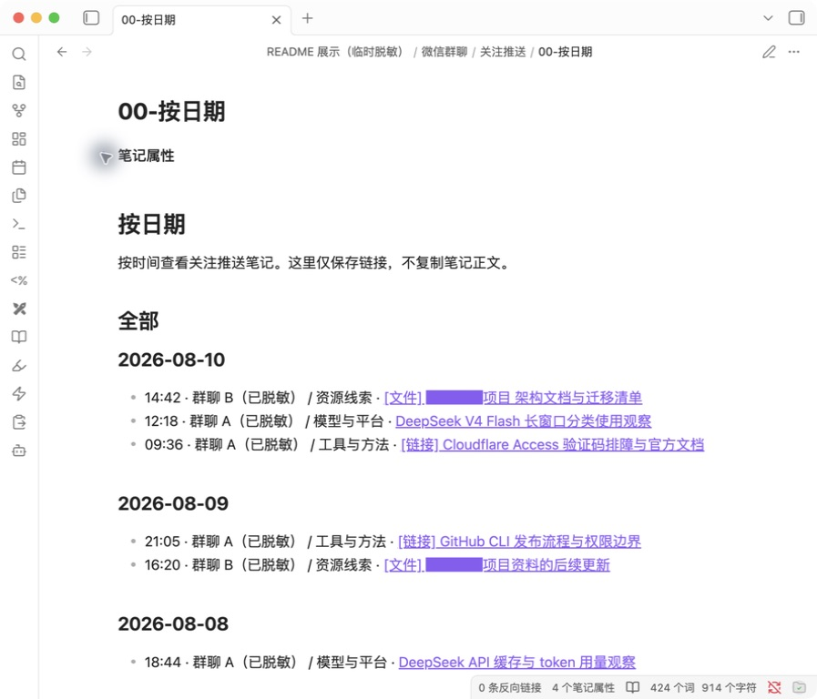
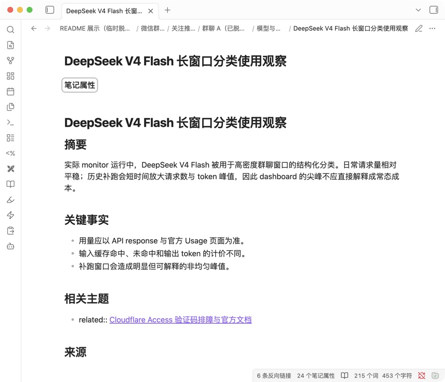
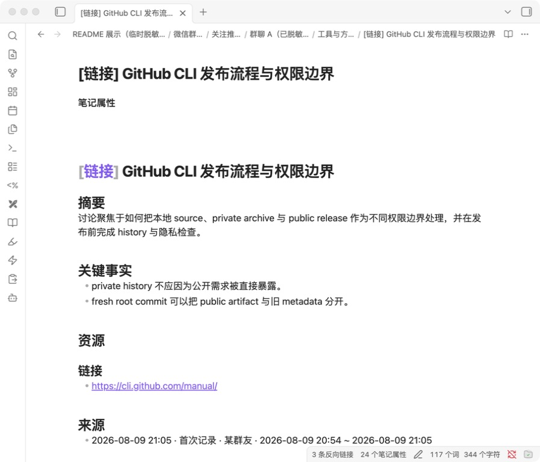
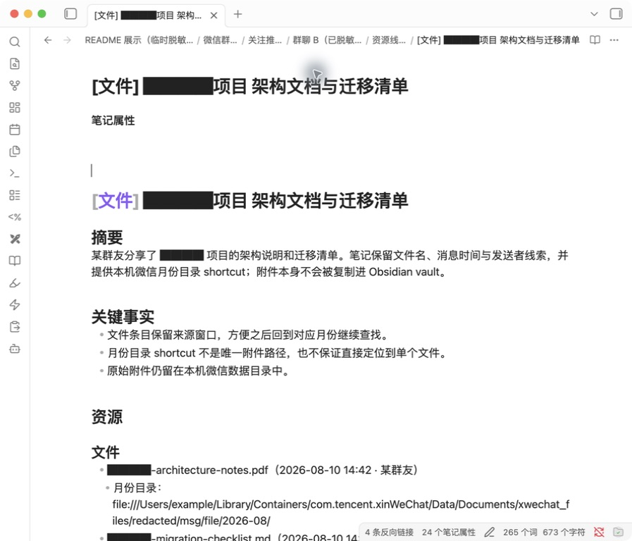

# we-groupchat-obsidian

Local-first WeChat group chat summaries, monitor review, and Obsidian knowledge output.

Status: source-only developer preview. Review the data-flow and account-safety notes before using it on real chat data.

A local-first macOS tool for reading your own WeChat desktop database, summarizing group chats, searching messages, and turning high-value group-chat updates into an Obsidian-friendly Markdown knowledge base.

This is not official WeChat/Tencent software, not a WeChat bot, not employee-monitoring software, and not fully offline when you enable cloud AI, remote link preview, or MCP sending. It does not use a WeChat API, does not run a remote service, and does not send your chat history to this project. The app reads local database files on your Mac and calls the AI provider you configure.

Project lineage: this standalone derivative builds on [Qizhan7/mac-wechat-summary](https://github.com/Qizhan7/mac-wechat-summary), which established the local macOS menu-bar summary and MCP foundation. This repository is not connected through GitHub's fork network and is not maintained as an upstream pull-request branch; it continues as a separate local-first Obsidian workflow project. See [NOTICE.md](NOTICE.md).

[完整中文版 README](README.zh-CN.md)

## Real Obsidian output

These screens are rendered in the real Obsidian app with the everyday theme.
For a public-safe view, they use temporary redacted copies that preserve the
current exporter's Markdown structure: chat names, people, private projects,
and local paths are replaced, while public company names and news topics such
as Cloudflare, DeepSeek, and GitHub remain. Properties, wiki links, title
markers, and note sections retain the real workflow format.



**Daily Digest** — One daily page for notes worth revisiting, resource
opportunities, and risk items. Linked titles open the underlying knowledge
note. Digests for the current month live directly under `Daily Digest/`; older
months are archived under `Daily Digest/YYYY-MM/`.



**Browse by date** — Global and per-chat `00-按日期.md` pages organize the full
note history as lightweight wiki-link maps without duplicating note bodies or
creating a second monthly archive.

### Different knowledge-note types



**Ordinary / news topic** — Keeps a structured summary, key facts, related
topics, and a source window for later search, linking, and reorganization.
Public companies and news subjects are intentionally left readable.



**`[链接]` note** — Adds public URLs and link resource metadata to the summary
and source trail, making it easy to move from the discussion back to the
original material.



**`[文件]` note** — Records the filename, message time, and sender clue. When the
matching local WeChat month directory exists, it also provides a shortcut to
that folder. It does not copy the attachment into the vault or guarantee a
direct pointer to one unique file.

## One real DeepSeek API usage sample

<table>
  <tr>
    <td width="50%"></td>
    <td width="50%"></td>
  </tr>
</table>

The screenshots show one real monitor deployment from `2026-07-12` through
`2026-08-10`: `2,980` `deepseek-v4-flash` API requests, `23,167,525` tokens, and
`¥19.78 CNY` shown by the account dashboard. The uneven spikes include a
historical catch-up run; they are not a steady daily baseline or a fixed-cost
promise for another installation.

DeepSeek bills actual token usage and distinguishes cached input, uncached
input, and output tokens. Cost also varies with the model, prompt and output
length, cache hits, and current official rates. This project does not maintain
its own cost ledger; the figures above come from DeepSeek Platform:

- [View your actual account usage](https://platform.deepseek.com/usage) (sign-in required)
- [View current official pricing](https://api-docs.deepseek.com/quick_start/pricing/)
- [Learn how token usage is measured](https://api-docs.deepseek.com/quick_start/token_usage/)

For a per-API-key breakdown, follow the
[official FAQ](https://api-docs.deepseek.com/faq/): select a month on the Usage
page and choose `Export`; the downloaded `amount` CSV groups usage by key. This
README links to the live pricing page instead of copying a price table that can
become stale.

## Features

- Menu bar summaries for new messages, custom ranges, and day-based reviews.
- Group chat organization and batch summaries.
- Cross-chat keyword search with optional AI summarization.
- Topic monitor for links, tutorials, product ideas, experiments, fixes, gossip, or any custom interest, with an independent background-notification toggle that does not stop monitoring or Obsidian writes.
- Local SQLite knowledge store plus Obsidian export, with distinct markers and resource metadata for ordinary, `[链接]`, `[文件]`, and `[链接+文件]` notes.
- Daily Digest with links back to single notes, plus an actionable review queue for concrete follow-up, import, reference, and risk-review work.
- Global and per-chat link-only `00-按日期.md` maps for browsing the complete note history without duplicating note bodies.
- Resource-lead detection for "can share privately / will share later / not public yet" situations where the artifact is not attached yet.
- Optional link preview context for public URLs; it is off by default and must be enabled explicitly.
- CLI and `.command` maintenance entrypoints for users whose menu bar icon is hidden.
- MCP server for read-only chat lookup, search, summaries, images, and optional UI-based sending.

## Privacy and Safety

- Runtime data is local by default: `~/.we-groupchat-obsidian/`.
- API keys are stored in macOS Keychain, not in the repo.
- WeChat database keys, logs, SQLite files, Markdown exports, and `.venv/` should never be committed.
- Extracting database keys may require ad-hoc re-signing `WeChat.app`. The regular double-click flow does not silently do this; commands that perform it are explicit.
- Cloud AI providers receive the text you ask them to summarize. Use Ollama if you want the AI step to stay local.
- Remote link previews are disabled by default. If you set `monitor_fetch_links: true`, the app fetches public URLs found in monitored messages, and those remote sites may receive your request metadata. Link preview has a conservative SSRF guard, but it is still a best-effort public URL preview, not a hardened crawler.
- MCP read tools expose local chat-derived data to the MCP client. Some management tools can mutate local metadata such as groups or config-derived state.
- MCP sending is disabled by default. Real UI-based sending requires `mcp_send_mode` (`allowlist` or `enabled`), macOS Accessibility permission, and the `prepare_send_message` -> user confirmation -> `confirm_send_message` nonce flow.

Before making a fork public, run a local scan:

```bash
git status --short
rg -n "sk-|api[_-]?key|secret|token|password|BEGIN .*PRIVATE|wxid_|chatroom|\\.we-groupchat-obsidian|\\.wechat-summary|all_keys|enc_key|image_aes_key" .
```

For a shareable source zip, build from tracked source files and exclude local
runtime artifacts, virtualenvs, build outputs, and internal continuity notes:

```bash
.venv/bin/python scripts/build_share_package.py
```

The generated zip includes an extra `群友使用说明.md` quick-start file and
omits internal handoff docs such as `docs/working-continuity.md` and
`docs/superpowers/`.

## Requirements

- macOS 12+
- Python 3.10+
- WeChat for macOS, logged in
- Xcode Command Line Tools
- One AI provider API key, or local Ollama
- Obsidian is optional

Supported AI providers: Qwen, DeepSeek, Claude, OpenAI, Ollama.

When DeepSeek is selected without an explicit `ai_model`, the current default
is `deepseek-v4-flash`; a different compatible model can still be configured.

## Quick Start

```bash
git clone https://github.com/IndelibleVivi/we-groupchat-obsidian.git
cd we-groupchat-obsidian
./启动.command
```

On the first run, or after `requirements.txt` changes, `启动.command` asks before
creating/updating `.venv` and installing dependencies. It proceeds only after an
explicit `y`; declining exits without installing anything. Distribution remains
source-only and CLI-based, with no `.dmg` or bundled Python runtime.

If WeChat was updated or key extraction needs a fresh authorization:

```bash
./启动.command --allow-wechat-resign
```

## Useful Commands

All of these can be double-clicked in Finder or run from Terminal.

| Command | Purpose |
| --- | --- |
| `./启动.command` | Start the menu bar app |
| `./配置关注推送.command` | Configure topic monitoring without using the menu bar UI |
| `./健康检查.command` | Redacted-by-default health check; use `--sensitive` only for local debugging |
| `./刷新数据源.command` | Refresh WeChat database keys after updates |
| `./历史总结到Obsidian.command` | Backfill historical summaries into Markdown |
| `./整理Obsidian输出.command` | Re-export and organize Markdown notes |
| `./安装自动启动.command` | Install LaunchAgent autostart |
| `./卸载自动启动.command` | Remove LaunchAgent autostart |

Equivalent CLI flags:

```bash
./启动.command --setup-only
./启动.command --configure-monitor
./启动.command --health-check
./启动.command --refresh-data-source
./启动.command --backfill-history
./启动.command --organize-obsidian
./启动.command --install-autostart
./启动.command --uninstall-autostart
```

Monitor maintenance helpers:

```bash
.venv/bin/python scripts/daily_digest.py
.venv/bin/python scripts/review_queue.py list
.venv/bin/python scripts/review_queue.py audit
.venv/bin/python scripts/review_queue.py cleanup
.venv/bin/python scripts/review_queue.py cleanup --apply
.venv/bin/python scripts/review_queue.py show <item-id>
.venv/bin/python scripts/review_queue.py mark <item-id> reviewed
.venv/bin/python scripts/organize_obsidian.py --taxonomy-dry-run
.venv/bin/python scripts/organize_obsidian.py --taxonomy-review-brief
.venv/bin/python scripts/organize_obsidian.py --dry-run
.venv/bin/python scripts/organize_obsidian.py --knowledge-audit
.venv/bin/python scripts/organize_obsidian.py --knowledge-audit --knowledge-audit-output "<path-to-report.md>"
.venv/bin/python scripts/repair_relations.py audit
.venv/bin/python scripts/repair_relations.py audit --db "<path-to-knowledge.db>"
.venv/bin/python scripts/repair_relations.py apply-known-invalid --backup "<new-backup.db>" --expect-count "<fresh-exact-count>" --confirm DELETE_EXACT_KNOWN_INVALID_RELATIONS
.venv/bin/python scripts/organize_obsidian.py --date-indexes-only
.venv/bin/python scripts/health_check.py --sensitive
.venv/bin/python scripts/health_check.py --delete-sensitive-key-log
```

### Guarded exact relation Markdown cleanup

This one-time repair is manifest-bound and has no implicit config lookup. Use
only a stopped, explicitly reviewed current database and vault root. The
verified pre-repair provenance backup is shown below; every other path must be
supplied explicitly:

```bash
.venv/bin/python scripts/repair_relation_markdown.py preview \
  --backup "/private/tmp/we-groupchat-monitor_knowledge-before-exact-relation-repair-2026-07-10.db" \
  --db "<stopped-current-monitor_knowledge.db>" \
  --vault-root "<monitored-vault-root>" \
  --obsidian-subdir "关注推送" \
  --run-dir "<new-private-run-directory>" \
  --generator-commit "<reviewed-generator-commit>" \
  --json

.venv/bin/python scripts/repair_relation_markdown.py status \
  --run-dir "<private-run-directory>" \
  --json

.venv/bin/python scripts/repair_relation_markdown.py apply \
  --run-dir "<private-run-directory>" \
  --manifest-sha256 "<full-manifest-sha256>" \
  --confirm "APPLY_EXACT_RELATION_MARKDOWN:<full-manifest-sha256>" \
  --json

.venv/bin/python scripts/repair_relation_markdown.py rollback \
  --run-dir "<private-run-directory>" \
  --manifest-sha256 "<full-manifest-sha256>" \
  --confirm "ROLLBACK_EXACT_RELATION_MARKDOWN:<full-manifest-sha256>" \
  --json
```

`preview` writes only a private sealed run artifact; treat that artifact as
sensitive because its manifest contains local paths and titles. Default CLI
output is redacted. `--sensitive` exposes only bounded path/title examples
(five by default, hard maximum 20), never note bodies, reasons, or rendered
relation lines.

`apply` is Markdown-only and exact-line-only. It does not re-export notes,
repair SQLite, or invoke any external vault writer. A live apply window requires
the we-groupchat LaunchAgent to be stopped and every external vault writer to
remain idle for the entire operation. Do not broaden this workflow into a general
`updates::` search-and-delete.

Use `关注推送 -> 后台通知：开/关` to mute or enable automatic banners. Turning
them off does not stop monitoring, knowledge writes, or Daily Digest generation;
manual action feedback and the explicit notification test remain available.

If system notifications do not appear, check the `Notification identity` line
in `./健康检查.command`. Source installs launched through a virtualenv can run as
`Python / org.python.python`, which may schedule notifications without showing a
stable app entry in macOS notification settings. A bundled `.app` build should
use `io.github.indeliblevivi.we-groupchat-obsidian` as its notification bundle
identity. The py2app build also uses `resources/app_icon.icns`, so macOS
Notification Center shows the project icon instead of py2app's default Python icon.

For a local app-bundle LaunchAgent identity:

```bash
.venv/bin/python -m pip install py2app
# If this virtualenv's pip is unavailable:
# uv pip install --python .venv/bin/python py2app
.venv/bin/python setup.py py2app --alias
.venv/bin/python scripts/autostart.py install --app-bundle dist/WeGroupchatObsidian.app --load-now
```

The `--alias` app points back to this source checkout and its `.venv`; it is
useful for local autostart notification identity, not as a standalone
distributable build.

## Runtime Data Migration

New installs use `~/.we-groupchat-obsidian/` for config, logs, key caches, monitor SQLite state, review queue data, and default Markdown output. Older local installs may still have `~/.wechat-summary/`; the loader can read the old config when the new config is absent and rebases project-owned default paths to the new directory.

For an existing local machine, migrate the actual files before restarting the LaunchAgent: move the old directory to `~/.we-groupchat-obsidian/` or keep `~/.wechat-summary` as a symlink to the new directory during the compatibility window. API keys saved under the old Keychain service name remain readable as a fallback, while new saves use `we-groupchat-obsidian`.

## LaunchAgent Compatibility

New autostart installs use the neutral LaunchAgent label `io.github.indeliblevivi.we-groupchat-obsidian`.
If an older local install already has a project-managed plist with a different label, the app preserves it by default so a running monitor is not interrupted. Health checks and uninstall commands discover managed plists by their project path, including same-named runtime copies, not by a hard-coded personal label.

The current project/repository name is `we-groupchat-obsidian`. Older local machines may still have an autostart runtime directory or LaunchAgent label containing `mac-wechat-summary` or `wechat-summary`; treat those as legacy compatibility names for that machine, not as the current project identity.

To opt in to a label migration after reviewing the impact:

```bash
./安装自动启动.command --migrate-label
```

## Monitor, Digest, and Obsidian Workflow

The topic monitor is designed to preserve useful signal without turning every interesting message into an alert.

If WeChat or the provider was unavailable and the monitor has a checkpointed backlog, use the guarded catch-up entry instead of advancing state by hand:

```bash
./补跑遗漏笔记.command          # read-only pending audit
./补跑遗漏笔记.command --apply  # pause, back up, drain, rebuild, validate, restore
```

Write mode requires the explicit `--apply` flag. It refuses chats without a recoverable checkpoint, uses the normal paginated `TopicMonitor` path, keeps AI failures from advancing state, stores a private partial-recovery backup under `~/.we-groupchat-obsidian/backups/monitor-catch-up/`, rebuilds affected source-date indexes and historical Daily Digests, validates SQLite/FTS/hash parity, and restores a previously loaded LaunchAgent in `finally`.

The catch-up backup currently contains only canonical SQLite plus per-chat checkpoints. It is useful for recovery evidence, but it is not a complete rollback bundle: Review Queue JSONL and Obsidian Markdown/index/Digest projections are not copied. A failed run may therefore retain successfully committed pages before the LaunchAgent resumes. Do not describe this backup as full rollback until a separate recovery policy covers every managed surface.

Catch-up uses a page-level partial-commit contract. Every `--apply` invocation writes a private, content-free JSON receipt under `~/.we-groupchat-obsidian/catch_up_receipts/`:

- `complete / drained`: every selected chat reached `no_messages`, projections and canonical validation passed, and the previously loaded LaunchAgent was restored.
- `partial / resume_required`: at least one page or managed projection committed, but a chat was blocked or a later operation failed. When `resume_supported` is `true`, rerun `./补跑遗漏笔记.command --apply`; each chat continues from its committed checkpoint.
- `failed / no_progress`: no monitor page committed. Inspect the receipt's error type/status and runtime state before retrying.
- `complete / no_op`: the audit found zero pending messages, so no backup, write, or LaunchAgent switch occurred.

Receipts contain anonymous monitor-state IDs, checkpoints before/after, page/status counts, canonical event IDs, affected dates, projection counts, validation, backup scope, and LaunchAgent restoration state. They do not copy chat bodies, AI titles, summaries, note paths, or Review Queue content. Non-complete runs return a nonzero exit status; the receipt, not an attempted automatic rollback, is the reconciliation authority.

- High-signal digest-only hits create knowledge notes and Daily Digest entries without becoming pending queue work.
- Actionable hits enter Review Queue only when there is a concrete next step: `follow_up_resource`, `import_resource`, `evaluate_reference`, or `review_risk`.
- Current-month Daily Digests default to `<monitor_obsidian_root>/<monitor_obsidian_subdir>/Daily Digest/YYYY-MM-DD Daily Digest.md`; older months are archived under `Daily Digest/YYYY-MM/YYYY-MM-DD Daily Digest.md`. Topic rows use Obsidian wiki links so the digest can jump directly to the underlying note.
- Review Queue audit is a dry-run maintenance surface for stale resource leads, legacy read-note items, and accumulated queue cleanup.
- Review Queue cleanup is dry-run by default. `scripts/review_queue.py cleanup` reports legacy digest-only queue debt; `--apply` marks only those non-actionable legacy items reviewed and leaves actionable resource/risk items pending.
- Taxonomy migration dry-run previews controlled folder folding for chats explicitly assigned to that taxonomy without writing SQLite rows or moving Markdown files.
- Taxonomy review brief prints a path/title/counts-only Markdown checklist with the full old-folder to new-folder mapping, unresolved `待归类` items, and metadata-only backfills.
- The write-side Obsidian organizer uses the same taxonomy mapping as the dry-run. Review `scripts/organize_obsidian.py --taxonomy-dry-run` and `--dry-run` before running the organizer without flags, because the no-flag command updates SQLite paths and rewrites Markdown.
- Knowledge audit prints a read-only Markdown report of topic relations, duplicate candidates, taxonomy review pressure, and path cleanup candidates so the note graph can be shared with Obsidian or other vault workflows without mutating the vault.
- Relation audit is read-only by default: `scripts/repair_relations.py audit` reports exact known-failure counts, cross-chat edges, self-loops, and relation dominance through a read-only SQLite connection, and redacts topic titles unless `--sensitive` is explicitly supplied.
- The sole write mode is the deliberately narrow `apply-known-invalid` repair. Stop the monitor first, supply a new backup path, a freshly audited exact row count, and the literal confirmation token shown above. It deletes only `updates` rows whose reason exactly matches the historical missing-method failure fingerprint; it refuses count drift, a pre-existing backup, integrity failures, FTS/topic mismatch, or orphan rows. It does not rebuild relations or touch topics, events, FTS rows, queue files, or Obsidian notes.
- Chats explicitly assigned to `human_ai_intimacy_v1` use the version 2 fixed folder taxonomy; `工具与模型` has been split into `模型与平台` and `工具与方法`, and free-form overlap belongs in `semantic_tags`, not new subfolders.
- Review queue files live under `~/.we-groupchat-obsidian/review_queue/`; they store derived titles, summaries, resource hints, links, and note paths, but do not copy raw chat bodies.

Default Obsidian note layout:

```text
微信群聊/关注推送/<chat-folder>/<category>/<note>.md
微信群聊/关注推送/00-按日期.md
微信群聊/关注推送/<chat-folder>/00-按日期.md
```

Single knowledge notes use resource-aware title markers: no prefix for ordinary
topics, `[链接]` for links, `[文件]` for files, and `[链接+文件]` when both are
present. The Markdown retains the summary, key facts, resources, related
topics, and source window. File entries record filename, message time, sender
clue, and—when available—a shortcut to the local WeChat month directory; they
do not copy attachments or promise a unique exact-file locator.

The `00-按日期.md` files are lightweight link-only date maps. They live at the root of each monitored scope and do not create monthly archive folders. Managed date index files are rewritten only when they carry a `we-groupchat-obsidian:managed-date-index` marker; older generated files with `wechat-summary:managed-date-index` are still recognized for compatibility. User-owned conflicting files fall back to `*.generated.md`.

## MCP Server

Example Claude Desktop config:

```json
{
  "mcpServers": {
    "we-groupchat-obsidian": {
      "command": "/absolute/path/to/we-groupchat-obsidian/.venv/bin/python3",
      "args": ["/absolute/path/to/we-groupchat-obsidian/mcp_server.py"]
    }
  }
}
```

The MCP server is read-oriented by default, but read tools can expose local chat-derived data to the MCP client, and management tools may mutate local metadata such as group configuration. Message sending is controlled by an explicit local mode:

```json
{
  "mcp_send_mode": "disabled"
}
```

Supported modes:

- `disabled`: never send.
- `dry_run`: report the target and text without touching WeChat; no nonce is needed.
- `allowlist`: only send to stable usernames in `mcp_send_allowlist`.
- `enabled`: allow named-target sends.

Blank targets are rejected in every non-disabled mode. For allowlists, use stable WeChat usernames such as `example@chatroom`, not display names:

```json
{
  "mcp_send_mode": "allowlist",
  "mcp_send_allowlist": ["example@chatroom"]
}
```

The old `mcp_enable_send_message: true` setting is still read as a backward-compatible shortcut for `enabled`, but new installs should use `mcp_send_mode`.

Real sends use a two-step confirmation flow. First call `prepare_send_message(text, chat_name)` and show the returned nonce, target, text preview, and expiry to the user. Only after the user confirms, call `confirm_send_message(nonce, text, chat_name)` with the exact same target and text. The compatibility `send_message` tool now prepares a nonce in real-send modes instead of sending immediately.

## Development

```bash
.venv/bin/python -m unittest discover -p 'test_*.py'
.venv/bin/python -m py_compile app.py mcp_server.py core/launch_agent.py core/monitor.py core/knowledge.py core/config.py core/wechat_db.py core/daily_digest.py core/link_preview.py core/notification_target.py core/notification_identity.py core/review_queue.py core/mcp_send_confirmation.py core/mcp_send_policy.py scripts/health_check.py scripts/refresh_data_source.py scripts/daily_digest.py scripts/review_queue.py scripts/organize_obsidian.py scripts/autostart.py
bash -n 启动.command
bash -n 刷新数据源.command
```

## What Changed in This Fork

This fork started from the same core idea as the upstream project: read the user's own local WeChat database on macOS and turn group chat history into useful AI summaries. The changes here are mostly practical adaptations from running the tool every day, especially when the menu bar app is hidden, WeChat updates break keys, or monitor output needs to become a durable local knowledge workflow.

- Local operations are more explicit: setup-only, health check, monitor configuration, data-source refresh, historical backfill, Obsidian re-export, and autostart install/uninstall all have CLI or `.command` entrypoints.
- WeChat update recovery is documented and scriptable through `./健康检查.command` and `./刷新数据源.command`, instead of depending on the menu bar UI being reachable.
- LaunchAgent handling is public-safe and compatible: new installs use a neutral label, while older project-managed plists are discovered by path and preserved unless migration is explicitly requested.
- Topic monitoring has been tuned toward high-signal, value-first summaries, with support for multiple chats, provider/model configuration, opt-in link preview context, forwarded-record parsing, local wake-from-sleep catch-up, and `P1/P2/P3` notification gating.
- Resource-lead handling keeps "can private-share / will share later / repo not public yet" opportunities visible even before a file or link appears.
- Obsidian output is treated as a first-class local knowledge base: notes are organized by chat/category, include safer resource sections, generate root-level link-only date maps, and can be re-exported without re-calling the AI provider.
- Daily digest and actionable review queue support were added so high-signal notes stay browsable in Obsidian while only concrete follow-up, import, reference-evaluation, or risk-review work becomes pending queue work.
- The public branch removes personal runtime defaults and adds tests around config sanitization, health checks, LaunchAgent discovery, monitor behavior, review queue, daily digest, notification targets, date indexes, and knowledge export contracts.

## Upstream

The upstream project is [Qizhan7/mac-wechat-summary](https://github.com/Qizhan7/mac-wechat-summary). If you want the original project history and baseline feature set, start there. This repository is a standalone derivative focused on reliability, maintenance, Obsidian workflows, and privacy-aware public sharing, with upstream attribution preserved in [NOTICE.md](NOTICE.md).

## License

[AGPL-3.0](LICENSE)
