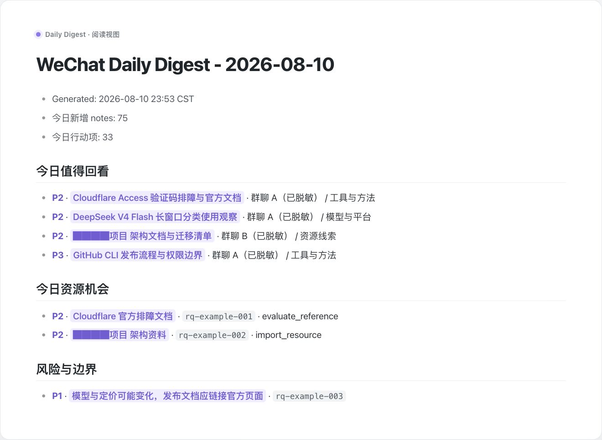
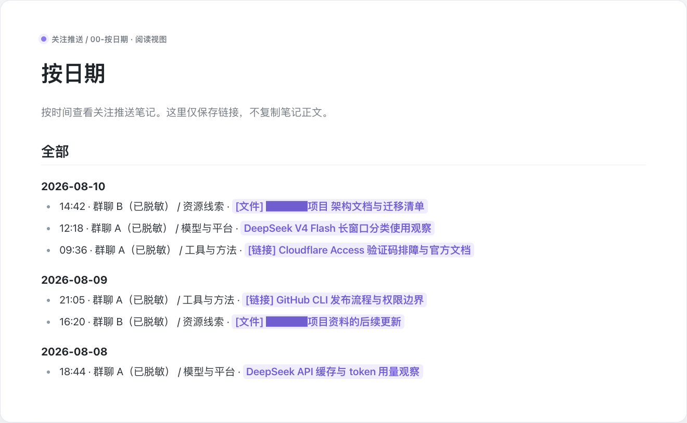
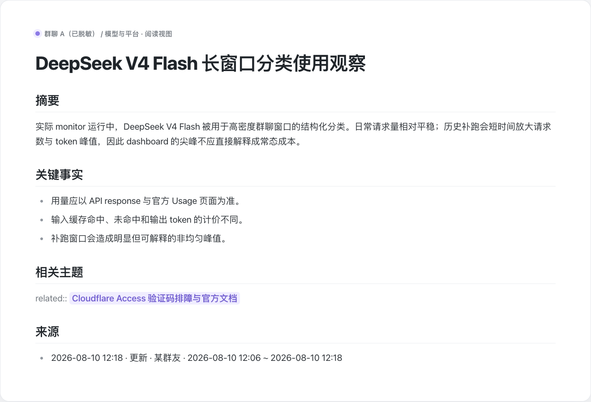
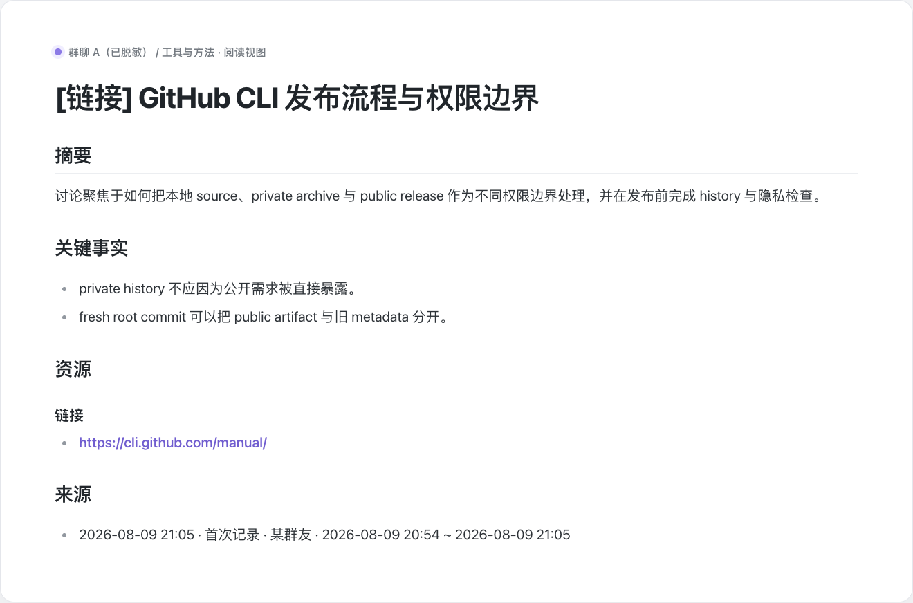
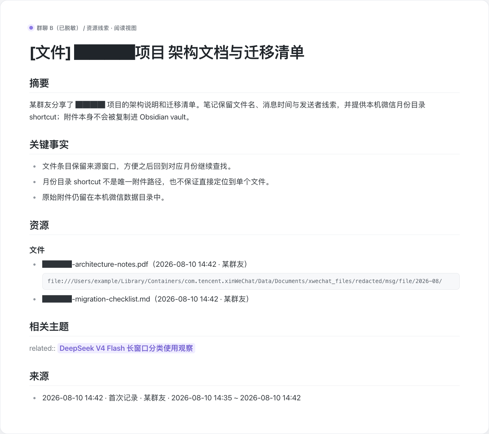
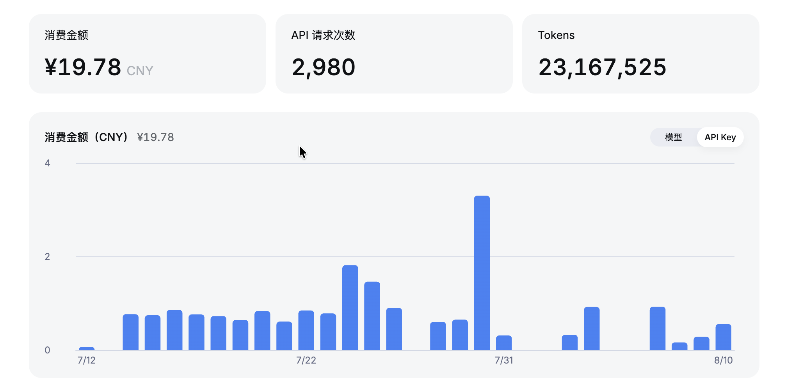
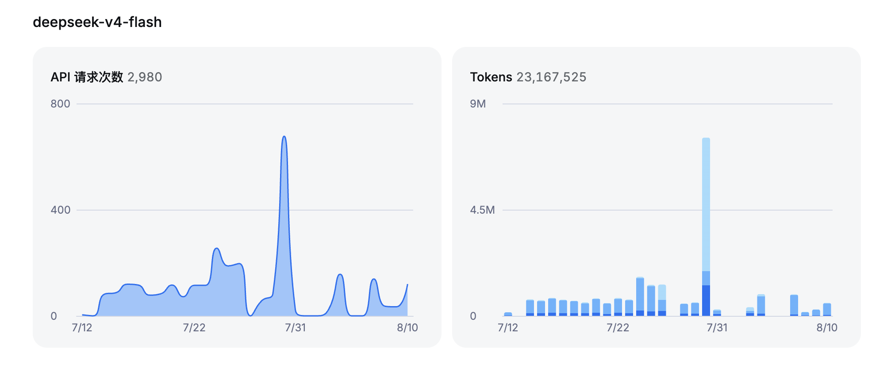
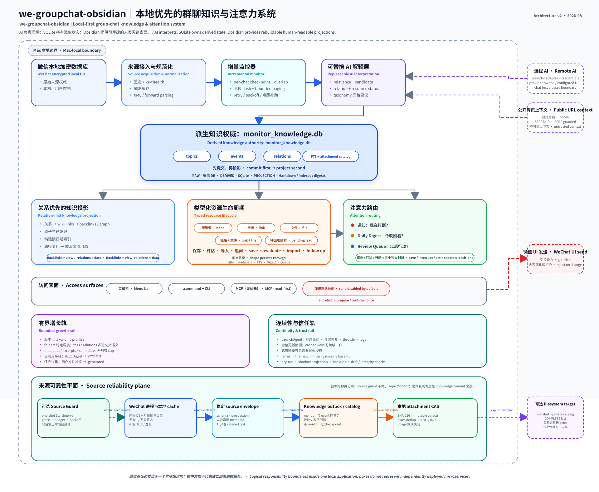
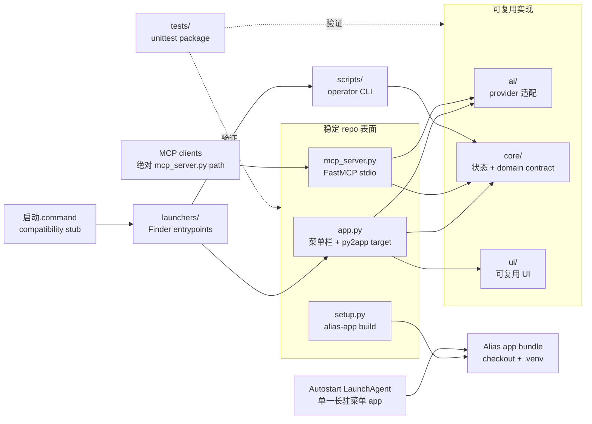

# we-groupchat-obsidian

本地优先的微信群聊总结、关注推送与 Obsidian 知识库工具。

当前状态：可完整运行的 source-distributed macOS app。它已经拥有菜单栏 app、MCP Server、
operator CLI、持久化本地状态、recovery/backup workers 和完整 regression suite；请先读完
数据流和账号安全边界，再在真实聊天数据上使用。当前不分发 bundled Python runtime
或已签名 installer。

Windows 迁移当前只到 **W0 可移植性基础阶段**：仓库建立了明确的模块/import 边界和
Windows CI，但 W0 不支持 Windows 微信发现、密钥、数据库读取、monitor、托盘、
backup、自启、打包或发送。分阶段契约见
[`docs/WINDOWS-PORT-MAP.md`](docs/WINDOWS-PORT-MAP.md)。

一个本地优先的 macOS 微信群聊总结工具。它读取你电脑上的微信本地数据库，生成群聊摘要、关键词搜索结果，并把值得关注的新消息整理成 Obsidian-friendly Markdown 笔记。

它不是微信/Tencent 官方软件，不是微信机器人，不是员工监控工具；当你启用云端 AI、远程链接预览或 MCP 发送时，它也不是完全离线工具。它不接入微信官方/非官方接口，也不会替你把聊天记录上传到项目作者的服务器。所有运行状态、数据库 key、知识库和导出文件默认都保存在你自己的 Mac 上。

项目来源说明：本项目是基于 [Qizhan7/mac-wechat-summary](https://github.com/Qizhan7/mac-wechat-summary) 的 standalone derivative。原项目打下了 macOS 菜单栏总结、本地微信数据库读取和 MCP 访问的基础；这个仓库没有挂在 GitHub fork network 里，也不作为 upstream PR 分支维护，而是继续发展成一个独立的 local-first Obsidian workflow 项目。见 [NOTICE.md](NOTICE.md)。


## Obsidian 输出预览

下面的画面由真实 exporter Markdown 的临时脱敏副本，按 Obsidian light reading view
的排版生成。为了让 README 里的正文清楚可读，画面只保留 note body，不包含侧栏、
ribbon、tab bar 或 status bar。群名、成员名、私有项目和本机路径已替换，
Cloudflare、DeepSeek、GitHub 等公开公司名和新闻主题保留；schema、wiki links、
标题标记和正文 section 仍与实际工作流一致。



**Daily Digest**：每天把值得回看的知识笔记、资源机会和风险项汇总到一页；
标题是可点击的 Obsidian wiki link，可以直接回到对应的单篇笔记。当前月份的
Digest 直接放在 `Daily Digest/`，更早月份归档到 `Daily Digest/YYYY-MM/`。



**按日期浏览**：总目录和每个群聊目录各有一份 link-only `00-按日期.md`，按日期
和时间串起完整笔记历史。它不复制正文，也不创建第二套月度 archive。

### 不同类型的知识笔记



**普通 / 新闻主题**：保留结构化摘要、关键事实、相关主题和来源窗口，适合之后
继续搜索、链接和重组。公开公司名或新闻对象不会为了脱敏而被抹掉。



**`[链接]` 笔记**：除了摘要与来源，还会保存公开 URL 和 link resource metadata，
便于从群聊讨论回到原始资料。



**`[文件]` 笔记**：记录文件名、消息时间、发送者线索和 archive resolution state。
显式开启的本地 archive 成功定位唯一 bytes 后，笔记会链接到私有 content-addressed object；
否则仍可提供对应微信月份目录的 hint。附件 bytes 不会复制进 vault 本身。

## 一次实际 DeepSeek API 用量参考

<table>
  <tr>
    <td width="50%"></td>
    <td width="50%"></td>
  </tr>
</table>

上图是一个实际 monitor 在 `2026-07-12` 至 `2026-08-10` 的账号后台样本：使用
`deepseek-v4-flash` 共发出 `2,980` 次 API 请求，处理 `23,167,525` tokens，后台
显示消费 `¥19.78 CNY`。图里的非均匀尖峰包含历史消息补跑，因此不是稳定的每日
请求量，也不是对其他安装的固定成本承诺。

DeepSeek 按实际 token 用量计费，输入缓存命中、输入缓存未命中和输出 token 的
单价不同；实际费用还会随模型、prompt、输出长度、cache hit 和官方调价变化。
本项目目前不自行保存一份 cost ledger，图中数字来自 DeepSeek Platform：

- [查看本账号的实际用量](https://platform.deepseek.com/usage)（需登录）
- [查看 DeepSeek 当前官方价格](https://api-docs.deepseek.com/zh-cn/quick_start/pricing/)
- [了解 token 用量口径](https://api-docs.deepseek.com/quick_start/token_usage/)

如需按 API Key 查看明细，可按[官方 FAQ](https://api-docs.deepseek.com/faq/)
所述，在 Usage 页面选择月份并点击 `Export`；下载包中的 `amount` CSV 会按 Key
拆分用量。README 不复制固定价目表，以免官方价格调整后留下过期数字。

## 架构



这张图沿着主数据路径展开：从微信本地加密数据库出发，经过来源规范化、增量监控和可替换的 AI
解释层，进入项目持久化的知识与注意力表面。最重要的边界是：

- 微信数据库始终是 raw source authority。项目只读取本地文件并维护自己的解密缓存，不回写微信数据库。
- `monitor_knowledge.db` 持有派生知识状态，包括 `topics`、`events`、`relations`、FTS 和附件 catalog。
  Attachment mention 与 Knowledge event 在同一个 transaction 里提交；定位和复制 bytes 发生在 commit 之后，
  所以归档失败不会回滚 event，也不会倒退 monitor checkpoint。Markdown 主题笔记、日期索引与 Daily Digest
  都是可重建 projection，遵循“先提交 SQLite，再投影”。
- 可选 source guard 是独立 control plane，不属于 `TopicMonitor`。它的 timer 位于长驻菜单栏 app 内，
  让受保护的微信访问维持同一个 process identity，而不是被短命 wake 反复索要授权。它只会在 grace、
  restart budget 和 backoff 判定通过后，请求 macOS 正常后台打开微信；不会 kill / re-sign 微信，
  不操作 UI 或登录，也不会把 `process lookup unknown` 当成“微信不存在”。
- 文件附件可以进入本机私有的 SHA-256 content-addressed archive，同一份 bytes 只保留一个 object。
  可选 backup 只把 immutable objects 复制到普通 filesystem target；验证的是目标目录 bytes，
  不是 sync provider 的云端上传状态。
- 默认 selected-resource backup lane 不需要 OAuth：它取 active monitor chats 与独立显式 selection 的交集，
  捕获 exact link / file metadata occurrences；只有显式开启时才把文件解析进共享 CAS，再把 immutable objects、privacy-bounded catalog
  与 Markdown views 交给 Google Drive for Desktop 等现有 mounted folder。`sync_delegated` 只证明 target bytes，
  不证明 provider-side upload。Scan、backfill、projection 与 handoff 会在 capture lock 下持有 canonical selection；
  real-output-root 与 target lock 会串行化 path aliases 和 cross-database writers。Busy、unknown 或 nested failure
  都会 fail closed，不会被推断成 success。每轮还会在 mounted backup 根部维护醒目的
  `00-打开微信资源备份.md`。平行的 `文件备份`、`待补齐附件` 与 `资源索引` views 会把已交付
  bytes 和所有未完成/需处理状态真正分开；已备份月页每个 digest 只列一行并显示 occurrence 次数，
  待补齐页绝不提供 target link。
- Direct Google Drive 文件同步是另一条可选 advanced lane：只扫描用户选定群聊，以 per-chat ×
  message-shard cursor 防止 partial shard read 推进遗漏。File message 不需要 Knowledge hit 就会进入
  durable queue 和 archive-owned provider-neutral CAS catalog；每个 digest 只上传一次，>5 MiB upload 按
  server-confirmed offset resumable，再按群聊/月份创建可读 shortcut。Remote identity 由 Drive file ID
  持有，不由可见名称或路径持有。
- 远程 AI 调用和显式开启的公开网页预览会跨出 Mac 本地边界；Ollama 可以让 AI 解释留在本机，
  而公开网页上下文默认关闭，并始终按 untrusted input 处理。
- 保存知识、立刻发通知、进入 Review Queue 供以后行动，是三个独立判断。微信 UI 发送属于另一条受控路径，
  默认关闭，并要求内容和目标不变的 `prepare_send_message` / `confirm_send_message` nonce 确认。

图中的方框表示同一个本地应用内的逻辑责任边界，不是独立部署的 microservices。可编辑源文件：
[中文主版 Excalidraw](docs/architecture/we-groupchat-obsidian-architecture.zh-CN.excalidraw) ·
[English-first Excalidraw](docs/architecture/we-groupchat-obsidian-architecture.en.excalidraw)。

## 现在能做什么

- 菜单栏总结：按群聊总结新消息、自定义最近 N 条/分钟、按天回顾、复制和打开历史总结。
- 群聊管理：读取最近活跃群聊，给群聊分组，批量总结多个群聊。
- 关键词搜索：跨群按关键词和日期搜索，可让 AI 归纳搜索结果。
- 关注推送：后台监控指定群聊里“值得看”的新功能、链接、教程、实验结论、产品想法或其他自定义主题；可独立关闭自动 banner，不影响监控和 Obsidian 写入。
- Obsidian 知识库：命中内容写入本地 SQLite，并导出为 Markdown；普通主题、`[链接]`、`[文件]` 和 `[链接+文件]` 使用不同的标题标记与 resource metadata。
- Daily Digest 和 Review Queue：高信号内容默认进入知识库和每日摘要；Digest 可以跳回单篇笔记，只把有明确下一步动作的条目放进待审阅队列。
- 按日期浏览：全局和每个群聊各有一份 link-only `00-按日期.md`，串起完整笔记历史而不复制正文。
- Resource Lead：识别“可以私发 / 晚点发 / repo 还没公开 / 求一份”这类资源还没出现但值得追问的窗口。
- 附件 catalog 与本地 content-addressed archive：archive 默认关闭；启用后相同 bytes 自动 dedup，图片仍需单独 opt-in。
- 可选、运行在长驻菜单栏 runtime 内的微信 source guard：grace、pause、restart budget、exponential backoff 与 content-free receipts。
- Provider-neutral filesystem snapshot：支持 attachment archive 的 plan、run、verify 和只读 restore plan。
- 默认 no-OAuth selected-resource mounted backup：把 exact links 与共享 CAS files 交给现有 Google Drive for Desktop 等挂载目录，同时生成轻量 Obsidian index、catalog snapshot 和诚实的 `sync_delegated` receipt。
- 可选 advanced Google Drive API lane：拥有独立 selection/control plane、durable queue、群聊/月 shortcut 与 retry/reconcile，不自动删除。
- 链接和转发展开：可选择补充公开网页标题/摘要；远程链接预览默认关闭。本地微信 XML 里可见的转发聊天记录会尽量解析。
- MCP Server：让 Claude Desktop、Claude Code、Cursor、OpenClaw 等 MCP 客户端只读查询群聊、搜索、总结、查看图片；发送消息默认关闭。
- 运维命令：即使菜单栏图标被隐藏，也可以用 `.command` 文件配置关注推送、健康检查、刷新数据源、历史回填和安装自启动。

## 隐私和风险边界

这个项目适合个人本地使用。它涉及微信本地数据库和进程内 key 提取，所以公开使用前请先理解这些边界：

- 程序读取本机微信数据库副本，不修改微信聊天数据库。
- 首次提取数据库 key，或微信更新后重新提取 key，可能需要对 `WeChat.app` 做 ad-hoc re-sign。脚本不会在普通双击启动时偷偷执行这一步，必须显式运行带 `--allow-wechat-resign` 的命令。
- macOS 可能在每次菜单 app 进程启动时询问一次 WeChat App Data 权限。项目不会再调度短命 source/resource
  worker 反复消耗这个 process-lifetime consent；附件 bytes 解析是仅存在于内存、本次 app 会话有效的
  显式授权，重启后必定归零，也不会从 config 恢复；关闭后，in-flight resolver 会在下一次读取附件
  bytes 之前取消。Links-only backfill 不读取附件 cache。
- 聊天内容会发送给你自己配置的 AI provider。使用 Ollama 本地模型时，内容可以完全不离开本机；使用云端 provider 时，请按对应服务的隐私规则自行判断。
- API Key 存储在 macOS Keychain，不写入 repo。
- 本地配置、书签、monitor state、数据库 key、日志、SQLite DB 和 Markdown 导出默认在 `~/.we-groupchat-obsidian/` 或你的 Obsidian vault 中，不应该提交到 git。旧 `~/.wechat-summary/` 只作为本机 migration/compatibility 路径保留。
- Attachment catalog、本地 archive、source-guard state/receipts 和 backup snapshot manifest/catalog 都是私有 runtime data。
  Archive object 含原始附件 bytes，绝不能提交或公开。
- Backup target 只是一个 filesystem path。如果它位于 Google Drive、Dropbox、iCloud Drive 等同步目录，
  对应 provider 可能按自己的隐私规则接收附件 bytes 和 manifest。Filesystem snapshot backend 仍然没有
  provider API，也不能验证 provider-side upload 是否完成。
- Direct Google Drive sync 是不同的 opt-in backend，只请求 `drive.file` OAuth scope。Refresh token 只在
  macOS Keychain，access token 只在内存；用户自己的 Installed desktop app OAuth client JSON 会复制到
  `0600` private runtime storage，绝不能提交。被选群聊的 configured stable alias、文件名与文件 bytes 会
  上传到用户自己的 Drive；raw `@chatroom` username、消息 body/XML、`source_message_id`、`wxid` 与
  WeChat cache path 不进入 Drive metadata。程序不删除 Drive 文件、微信 cache 或本地 CAS object。
- 远程链接预览默认关闭。只有显式设置 `monitor_fetch_links: true` 后，程序才会请求关注消息里的公开 URL；远端网站可能收到你的请求元数据。链接预览有保守的 SSRF 防护，但它仍然只是 best-effort public URL preview，不是 hardened crawler。
- MCP read tools 会把本地 chat-derived data 暴露给 MCP client；部分管理工具可以修改本地 metadata，例如分组或配置衍生状态。
- MCP 的发送微信消息能力默认关闭。真实 UI 发送需要显式设置 `mcp_send_mode`（`allowlist` 或 `enabled`）、授予辅助功能权限，并走 `prepare_send_message` -> 用户确认 -> `confirm_send_message` nonce 流程。

公开 fork 前建议跑：

```bash
git status --short
rg -n "sk-|api[_-]?key|secret|token|password|BEGIN .*PRIVATE|wxid_|chatroom|\\.we-groupchat-obsidian|\\.wechat-summary|all_keys|enc_key|image_aes_key" .
```

向其他人分享时，直接发送[公开 repo](https://github.com/IndelibleVivi/we-groupchat-obsidian)
或[中文版 README](https://github.com/IndelibleVivi/we-groupchat-obsidian/blob/main/README.zh-CN.md)。
不要重新压缩自己正在运行的 checkout；其中可能已经出现 `.venv`、本机 runtime、
cache、日志或私有调试材料。

公开 repo 是正式分发与更新入口。zip builder 只作为没有 Git/网络条件，或必须保留
exact-commit archival artifact 时的历史 offline fallback；它不是给群友分享项目的正常路径。
如果确实需要这个 fallback，只能从 exact committed Git tree 构建：

```bash
.venv/bin/python scripts/build_share_package.py
```

生成的 zip 严格取当前 commit 的 Git tree，并附带 hash-bound v2 `share-manifest.json`。Payload 来自
exact commit tree；compatibility name 仍为 `群友使用说明.md` 的离线说明来自同一 commit 的
`docs/share-package-guide.zh-CN.md`，其 mode 与 SHA-256 记录在 `controls.guide`，`source_commit` 必须是
40/64 位 hex immutable object ID。没有 `.git` 的复制目录
只能按该 manifest allowlist 与 guide control 构建；bound member 缺失、被修改、命中 secret scan、是
symlink 或 non-regular file 时都会 fail closed。包仍会排除本机 runtime、`.venv`、build/cache 产物和
internal continuity docs。

## 安装

### 前置条件

- macOS 12+
- Python 3.10+
- 微信桌面版，并已登录
- 至少一个 AI provider API Key，或本地 Ollama
- Xcode Command Line Tools，用于编译 key scanner
- Obsidian 可选；只想生成 Markdown 文件时不需要安装

支持的 AI provider：

- 通义千问
- DeepSeek
- Claude
- OpenAI
- Ollama 本地模型

选择 DeepSeek 且没有显式填写 `ai_model` 时，当前默认使用
`deepseek-v4-flash`；仍可在配置中指定其他兼容 model。

### 快速开始

```bash
git clone https://github.com/IndelibleVivi/we-groupchat-obsidian.git
cd we-groupchat-obsidian
./启动.command
```

第一次运行或 `requirements.txt` 更新时，`启动.command` 会先询问是否创建/更新 `.venv` 并安装 dependencies；只有明确输入 `y` 才会继续，不同意则直接退出。项目是 source-distributed macOS menu-bar app，目前不提供已签名 installer、`.dmg` 或 bundled Python runtime。若 macOS 阻止打开 `.command` 文件，右键它，选择“打开”，再确认打开。

如果提示微信需要重新授权，请阅读终端说明后手动运行：

```bash
./启动.command --allow-wechat-resign
```

这一步可能会退出微信，并要求输入 Mac 登录密码。输入密码时终端不显示字符是正常的。

### 文档地图

- `README.md` / `README.zh-CN.md`：当前用户、operator、隐私和项目概览 authority。
- `使用说明.txt`：随源码和本地 `.app` bundle 保留的离线快速入门，刻意比 README 短。
- `功能说明.txt`：当前能力的简明索引，不替代操作 contract。
- `docs/source-reliability*.md`：source guard、archive、mounted backup、Drive、
  filesystem snapshot 和 safe rollout 的详细 contract。
- `docs/resource-capture-and-mounted-backup-spec.md`：resource occurrence、selection、
  projection、handoff、status 与 failure semantics 的 formal spec。

## 常用命令

Canonical Finder helper 统一放在 `launchers/`，都可以双击运行或在 Terminal
执行。根目录只保留一个极薄的 `启动.command` compatibility entrypoint，供已有
source install 与 LaunchAgent 继续使用。

| 命令 | 用途 |
| --- | --- |
| `./启动.command` | 启动菜单栏应用 |
| `./启动.command --setup-only` | 只检查环境和依赖，不启动 app |
| `./launchers/配置关注推送.command` | 不依赖菜单栏，配置监控群聊、关注描述、AI Key 和 Obsidian 输出 |
| `./launchers/健康检查.command` | 打印 redacted-by-default 状态；只有本地排查时才加 `--sensitive` |
| `./launchers/刷新数据源.command` | 微信更新后刷新数据库 key，不需要找到菜单栏图标 |
| `./launchers/历史总结到Obsidian.command` | 把历史消息按天总结并导出到 Obsidian |
| `./launchers/整理Obsidian输出.command` | 只整理/重导出知识库 Markdown，不调用 AI |
| `./launchers/安装自动启动.command` | 安装 macOS LaunchAgent 登录自启 |
| `./launchers/卸载自动启动.command` | 卸载登录自启 |
| `./launchers/补跑遗漏笔记.command` | 审计或显式执行 bounded monitor catch-up |

等价 CLI 参数：

```bash
./启动.command --configure-monitor
./启动.command --health-check
./启动.command --refresh-data-source
./启动.command --backfill-history
./启动.command --organize-obsidian
./启动.command --install-autostart
./启动.command --uninstall-autostart
```

面向 monitor 的维护脚本：

```bash
.venv/bin/python scripts/daily_digest.py
.venv/bin/python scripts/review_queue.py list
.venv/bin/python scripts/review_queue.py audit
.venv/bin/python scripts/review_queue.py cleanup
.venv/bin/python scripts/review_queue.py cleanup --apply
.venv/bin/python scripts/review_queue.py show <item-id>
.venv/bin/python scripts/review_queue.py mark <item-id> reviewed
.venv/bin/python scripts/organize_obsidian.py --taxonomy-dry-run
.venv/bin/python scripts/organize_obsidian.py --taxonomy-review-brief
.venv/bin/python scripts/organize_obsidian.py --dry-run
.venv/bin/python scripts/organize_obsidian.py --knowledge-audit
.venv/bin/python scripts/organize_obsidian.py --knowledge-audit --knowledge-audit-output "<path-to-report.md>"
.venv/bin/python scripts/organize_obsidian.py --date-indexes-only
.venv/bin/python scripts/health_check.py --sensitive
.venv/bin/python scripts/health_check.py --delete-sensitive-key-log
```

Source reliability 运维脚本：

```bash
# Source guard 默认关闭；长驻菜单 app 负责 timer。
.venv/bin/python scripts/wechat_source_guard.py status
.venv/bin/python scripts/wechat_source_guard.py enable
.venv/bin/python scripts/wechat_source_guard.py pause --hours 8
.venv/bin/python scripts/wechat_source_guard.py pause --indefinite
.venv/bin/python scripts/wechat_source_guard.py resume
.venv/bin/python scripts/wechat_source_guard.py check
# 仅用于移除旧版本留下的短命 agent。
.venv/bin/python scripts/wechat_source_guard.py uninstall-agent

# Attachment archive 默认关闭；历史 backfill 没有 --apply 时只输出 plan。
.venv/bin/python scripts/attachment_archive.py status
.venv/bin/python scripts/attachment_archive.py run
.venv/bin/python scripts/attachment_archive.py retry --mention-id <id> --run
.venv/bin/python scripts/attachment_archive.py backfill
.venv/bin/python scripts/attachment_archive.py backfill --apply

# 默认 selected-resource mounted backup：不需要 OAuth，也不调用 Drive API。
.venv/bin/python scripts/resource_backup.py list-chats
.venv/bin/python scripts/resource_backup.py set-selected-chats 1
.venv/bin/python scripts/resource_backup.py clear-selected-chats
.venv/bin/python scripts/resource_backup.py set-target "<已经存在的挂载目录>"
.venv/bin/python scripts/resource_backup.py set-link-export-mode redacted
.venv/bin/python scripts/resource_backup.py init
.venv/bin/python scripts/resource_backup.py enable
.venv/bin/python scripts/resource_backup.py disable
.venv/bin/python scripts/resource_backup.py backfill-links --all
.venv/bin/python scripts/resource_backup.py backfill-links --all --apply --run-id <plan 返回的 run-id>
.venv/bin/python scripts/resource_backup.py backfill-links --from YYYY-MM-DD
.venv/bin/python scripts/resource_backup.py backfill-links --from YYYY-MM-DD --apply --run-id <plan 返回的 run-id>
.venv/bin/python scripts/resource_backup.py backfill --all
.venv/bin/python scripts/resource_backup.py backfill --all --apply --run-id <plan 返回的 run-id>
.venv/bin/python scripts/resource_backup.py backfill --from YYYY-MM-DD
.venv/bin/python scripts/resource_backup.py backfill --from YYYY-MM-DD --apply --run-id <plan 返回的 run-id>
.venv/bin/python scripts/resource_backup.py status
.venv/bin/python scripts/resource_backup.py plan
.venv/bin/python scripts/resource_backup.py run
.venv/bin/python scripts/resource_backup.py run --resolve-files --resolve-limit 10
.venv/bin/python scripts/resource_backup.py verify
# 以下两个命令只负责检查/移除旧 agent；不会再安装新 agent。
.venv/bin/python scripts/resource_backup.py agent-status
.venv/bin/python scripts/resource_backup.py uninstall-agent

# 可选 advanced Google Drive API lane；OAuth 与选群都和 mounted backup 独立。
.venv/bin/python scripts/google_drive_file_sync.py auth --client-secrets "<installed-desktop-client.json>"
.venv/bin/python scripts/google_drive_file_sync.py auth-status
.venv/bin/python scripts/google_drive_file_sync.py status
.venv/bin/python scripts/google_drive_file_sync.py enable
.venv/bin/python scripts/google_drive_file_sync.py disable
.venv/bin/python scripts/google_drive_file_sync.py pause
.venv/bin/python scripts/google_drive_file_sync.py resume
.venv/bin/python scripts/google_drive_file_sync.py scan
.venv/bin/python scripts/google_drive_file_sync.py run
.venv/bin/python scripts/google_drive_file_sync.py reconcile
.venv/bin/python scripts/google_drive_file_sync.py backfill --from YYYY-MM-DD
.venv/bin/python scripts/google_drive_file_sync.py backfill --from YYYY-MM-DD --apply
.venv/bin/python scripts/google_drive_file_sync.py disconnect

# 可选 filesystem backup target，也可以指向某个同步目录。
.venv/bin/python scripts/attachment_backup.py set-target "<filesystem-target>"
.venv/bin/python scripts/attachment_backup.py plan
.venv/bin/python scripts/attachment_backup.py run
.venv/bin/python scripts/attachment_backup.py verify
.venv/bin/python scripts/attachment_backup.py restore-plan
.venv/bin/python scripts/attachment_backup.py clear-target
```

Source guard 与 mounted-resource scheduling 都位于长驻菜单 app。旧 `install-agent` 命令会拒绝创建新的
短命 job；`uninstall-agent` 只为升级用户清理旧 plist。`backfill-links` 是 links-only staged plan/apply
入口：不读附件 bytes；任一 known shard 不完整时 canonical occurrence 写入数必须为 0。Plan 以
500-2,000 rows 的 bounded keyset page 写入 staging，不创建或推进 live cursor；apply 必须同时给出
`--apply` 与 plan 返回的未过期 `--run-id`，只消费那一份 staged rows，不会确认后再扫描 source。
普通 resource `run` 默认不解析附件；`--resolve-files` 只授权该次显式 CLI run，菜单授权仅持续当前
app process，并在每次附件 byte operation 前重新检查。每个 mounted target 都会得到一个绑定本地
archive 的随机 destination marker；相同路径被新 target 替换、或另一 archive 误用同一目录时会
fail closed，不复用 receipt 或 managed projection ownership。Drive `enable` 不会顺手 auth、选群、backfill 或 upload。Backup `verify`
只验证 configured filesystem target 上看得到的 bytes，绝不宣称 provider-side upload 已完成。Drive
mounted handoff、可选 Drive API、完整状态、resolver 规则、存储结构和失败边界见
[来源可靠性指南](docs/source-reliability.zh-CN.md)。

每轮 resource backup 还会维护一个容易发现的 Obsidian 总入口：
`<monitor_obsidian_subdir>/00-资源索引.md`。它链接到每个显式选中群聊自己的
`00-资源索引.md` 与月度页面。月度页面刻意保持轻量，只显示日期、时间和可点击的链接/文件：
WeChat 有 observed title 时使用 title；没有 title 时直接把完整 exact URL 作为可见 label。
sender、hash、source-message identity 和 handoff 详情继续留在私有 catalog，不挤进阅读层。
这些文件即使名字里没有 `.generated`，也仍然是
app-owned generated Markdown；只有首选文件名已被猫手写内容占用、程序必须避免覆盖时，
才会退到 `00-资源索引.generated.md` 或月份 `.generated.md`。Projection writer 会在整个
render/handoff 期间持有 canonical selected-chat authority，再按 output root 的 real path 取得私有
root-identity lock；因此不同 capture DB 或不同 path alias 指向同一 root 时也会串行化。若 managed
descendant 已是 symlink 或非目录，会在写 generated file 或 target bytes 前 fail closed。

Mounted target 另有一个真正给人打开的入口：
`<target>/wgo-resource-backup/00-打开微信资源备份.md`；菜单栏的
`📂 在 Finder 打开文件备份` 会直接在 Finder 中 reveal 它。入口下的 `文件备份` 页面只列文件，
按显式选中的群聊与月份分组，但只收录真正 delivered 的文件；同一 digest 只出现一行，并显示它在
群聊记录中的 occurrence 次数。独立的 `待补齐附件` family 会按尚未尝试、cache unavailable、retry、
本地空间、需处理、awaiting handoff 与 unknown 分组，且不生成可点击 target link。Portal 同时报告
去重 object 数、delivered occurrence 数与 backlog 分解。这个 view 不复制第二份 payload bytes，
“已备份”仍只证明 mounted filesystem handoff，不证明 provider-side cloud sync 已完成。这些是 mounted
filesystem 上的 portable relative Markdown links，本 lane 不冒充 Google Drive 网页端的原生
rendering 或 Drive shortcut。

App 与 CLI 共用这套 coverage classifier。为兼容现有 automation，`completed` 与 CLI exit code 仍保持
严格；新增的 `operational_success`、`coverage_complete` 与 `coverage` 会把“本轮健康更新了索引，但仍有
正常附件 backlog”和真实 source/projection/target failure 分开。普通 receipt-backed status 只读 metadata，
显式 `verify` 才做完整 target-byte audit。

菜单栏的 `关注推送 -> 后台通知：开/关` 是自动 banner 总开关。关闭后，
后台监控、知识库写入和 Daily Digest 仍会继续运行，只是不再显示自动命中、
心跳、后台错误和 Digest 通知；手动操作反馈与“测试系统通知”仍会显示。

如果系统级通知一直不出现，先看 `./launchers/健康检查.command` 里的
`Notification identity`。源码目录 + virtualenv 启动时，进程可能显示为
`Python / org.python.python`；这种情况下 rumps 可以成功 schedule 通知，但
macOS 可能不会给项目一个稳定的通知设置入口，也不一定弹 banner。正式 `.app`
打包应使用 `io.github.indeliblevivi.we-groupchat-obsidian` 作为通知 bundle
identity，并使用仓库里的 `resources/app_icon.icns`，避免通知中心显示 py2app
默认的 Python 图标。

如果想让登录自启直接走本地 `.app` 身份：

```bash
.venv/bin/python -m pip install py2app
# 如果这个 virtualenv 的 pip 不可用：
# uv pip install --python .venv/bin/python py2app
.venv/bin/python setup.py py2app --alias
.venv/bin/python scripts/autostart.py install --app-bundle dist/WeGroupchatObsidian.app --load-now
```

这里的 `--alias` app 依赖当前源码目录和 `.venv`，适合本机 LaunchAgent /
系统通知 identity，不是 standalone distributable build。Source-guard 与 mounted-resource timer
都运行在同一个长驻菜单 app 内。旧短命 mode 现在只返回 `long_lived_app_required`，不会触碰 protected
data；对应 uninstall 命令负责移除历史 scheduled plist。

## Runtime Data Migration

新安装默认使用 `~/.we-groupchat-obsidian/` 保存 config、logs、key cache、monitor SQLite state、Review Queue 和默认 Markdown 输出。旧本机环境可能还存在 `~/.wechat-summary/`；如果新 config 不存在，程序会读取旧 config，并把项目默认路径 rebased 到新目录。

已有机器迁移时，应在重启 LaunchAgent 前迁移实际文件：把旧目录移动到 `~/.we-groupchat-obsidian/`，或在兼容期内保留 `~/.wechat-summary` -> `~/.we-groupchat-obsidian` 的 symlink。旧 Keychain service name 下的 API Key 仍会作为 fallback 读取，新保存的 key 会写到 `we-groupchat-obsidian`。

## LaunchAgent 兼容策略

新安装的登录自启默认使用 neutral label：

```text
io.github.indeliblevivi.we-groupchat-obsidian
```

如果旧版本已经安装过当前项目的 LaunchAgent，脚本会按 plist 里的 `ProgramArguments` / `WorkingDirectory` 自动识别，并默认保留旧 label，避免把正在运行的 monitor 迁到另一个 job。健康检查和卸载也按“是否指向当前项目或同名 runtime copy”识别，不依赖硬编码个人 label。

当前项目 / repo 名是 `we-groupchat-obsidian`。旧本机环境里如果还看到 runtime 目录或 LaunchAgent label 带 `mac-wechat-summary` / `wechat-summary`，应视为这台机器上的 legacy compatibility name，不代表当前项目身份。

如果你确认要把旧 label 迁移到 neutral label，可以显式运行：

```bash
./launchers/安装自动启动.command --migrate-label
```

## 关注推送工作流

关注推送适合盯“不是每条都重要，但错过会可惜”的群聊信息。

1. 运行 `./launchers/配置关注推送.command`。
2. 从最近活跃群聊中选择一个或多个群聊。
3. 写下关注描述，例如：

```text
提醒我群里出现值得进一步了解的新功能、AI/产品新想法、链接、教程、实验结果、修复方案或可执行做法。普通闲聊、只有情绪没有对象和信息量的内容不要通知。
```

4. 选择 AI provider，配置 API Key。
5. 配置 Obsidian vault 或使用默认输出目录。

后台检查不是“每隔 N 分钟必写一篇 note”。`monitor_interval_minutes` 只是轮询间隔；只有真的命中关注主题，并通过 AI 判断值得保存时，才会写入知识库和 Markdown。

命中后的处理逻辑：

- 高信号但无下一步动作的内容会保存在知识库和 Daily Digest，但不进入 Review Queue；单条通知仍按 `P1/P2/P3` gating 判断。
- Review Queue 只放真正有动作的条目：`follow_up_resource`、`import_resource`、`evaluate_reference`、`review_risk`。
- Daily Digest 当前月份默认写到 `<monitor_obsidian_root>/<monitor_obsidian_subdir>/Daily Digest/YYYY-MM-DD Daily Digest.md`；更早月份归档到 `Daily Digest/YYYY-MM/YYYY-MM-DD Daily Digest.md`。里面的主题使用 Obsidian wiki link，可直接跳转到对应笔记。
- Review Queue audit 是维护视角，只做 dry-run 报告，用来检查 stale resource leads、旧 `read_note` 队列项和积压清理建议，不是 daily digest 的正文。
- Review Queue cleanup 默认也是 dry-run：`scripts/review_queue.py cleanup` 只报告 legacy digest-only 队列债务；只有加 `--apply` 才会把这些非行动项标成 reviewed，并保留真正 actionable 的资源/风险条目。
- Taxonomy migration dry-run 会预览已显式绑定到该 taxonomy 的群聊 folder 收缩，不写 SQLite，也不移动 Markdown 文件。
- Taxonomy review brief 会输出 path/title/counts-only 的 Markdown 检查清单，包含完整 old-folder 到 new-folder mapping、未解决的 `待归类` 条目和 metadata-only backfill。
- 写入侧的 Obsidian organizer 和 dry-run 使用同一套 taxonomy mapping。运行无参数 organizer 前，先看 `scripts/organize_obsidian.py --taxonomy-dry-run` 和 `--dry-run`；无参数命令会更新 SQLite path 并重写 Markdown。
- Knowledge audit 会输出只读 Markdown 报告，汇总 topic relations、duplicate candidates、taxonomy review pressure 和 path cleanup candidates，方便把笔记关系共享给 Obsidian 或其他 vault 工作流，不会改 vault。
- 显式绑定到 `human_ai_intimacy_v1` 的群聊会使用 version 2 固定 folder taxonomy；`工具与模型` 已拆成 `模型与平台` 和 `工具与方法`，交叉语义放进 `semantic_tags`，不再生成新的 subfolders。

Review Queue 文件保存在 `~/.we-groupchat-obsidian/review_queue/`；里面只存派生标题、摘要、资源线索、链接和笔记路径，不复制 raw chat bodies。

如果 Mac 睡眠导致普通菜单栏 timer 错过检查，程序会在醒来后做轻量补跑。默认只在命中、写入或报错时通知；如果想确认后台仍然活着，可以在菜单栏里打开“心跳通知”。

## Obsidian 输出

默认知识库数据库：

```text
~/.we-groupchat-obsidian/monitor_knowledge.db
```

默认 Markdown vault：

```text
~/.we-groupchat-obsidian/obsidian_knowledge/
```

如果你配置了自己的 Obsidian vault，程序只会写入配置的子目录，默认是：

```text
微信群聊/关注推送/
```

笔记路径示例：

```text
微信群聊/关注推送/示例群聊/工具更新/[链接] Claude Code 封窗解决方案.md
```

单篇知识笔记会按资源形态使用不同的标题标记：普通主题不加前缀，链接使用
`[链接]`，文件使用 `[文件]`，同一主题同时包含两者时使用 `[链接+文件]`。
Markdown 正文会保留摘要、关键事实、资源、相关主题和来源窗口。文件条目始终保留
文件名、消息时间、发送者线索，并可提供本机微信月份目录 hint。独立 opt-in 的本地
archive 成功归档 occurrence 后，note 还可以链接到私有 CAS object；
attachment bytes 仍不会复制进 vault 本身。

每个群聊文件夹也会生成一个 `00-按日期.md`，总目录会生成 `微信群聊/关注推送/00-按日期.md`。这些日期视图只保存 wiki links，不复制笔记正文；目前完整历史会保留在这两个 root-level link map 中，不再创建 `按日期/YYYY-MM.md` 月度 archive 文件夹。旧版 managed archive 文件夹只会作为清理对象处理。

日期索引只会覆盖带有 `we-groupchat-obsidian:managed-date-index` 标记的文件；旧版生成过的 `wechat-summary:managed-date-index` 文件仍会被识别为 managed，以便原地升级。如果同名文件已经被你手写占用，程序会保留它，并改写到 `00-按日期.generated.md`。

如果微信群聊改名，但你想让 vault 文件夹保持稳定，可以在本地配置里设置 `monitor_chat_aliases`：

```json
{
  "monitor_chat_aliases": {
    "<chat-username>": "稳定群聊文件夹名"
  }
}
```

## MCP Server

以 Claude Desktop 为例，在配置文件中添加：

```text
~/Library/Application Support/Claude/claude_desktop_config.json
```

示例配置：

```json
{
  "mcpServers": {
    "we-groupchat-obsidian": {
      "command": "/absolute/path/to/we-groupchat-obsidian/.venv/bin/python3",
      "args": ["/absolute/path/to/we-groupchat-obsidian/mcp_server.py"]
    }
  }
}
```

MCP 默认偏只读，但 read tools 会把本地 chat-derived data 暴露给 MCP client，管理工具也可能修改本地 metadata，例如群聊分组配置。发送微信消息由本地 `mcp_send_mode` 控制：

```json
{
  "mcp_send_mode": "disabled"
}
```

可选模式：

- `disabled`：永不发送。
- `dry_run`：只回显目标和内容，不触碰微信，不需要 nonce。
- `allowlist`：只允许发送到 `mcp_send_allowlist` 里的稳定 username。
- `enabled`：允许发送到非空目标。

所有非 disabled 模式都拒绝空目标，不会再发送到“当前打开聊天”。allowlist 请使用 `example@chatroom` 这类稳定 username，不要用群显示名：

```json
{
  "mcp_send_mode": "allowlist",
  "mcp_send_allowlist": ["example@chatroom"]
}
```

旧配置 `mcp_enable_send_message: true` 仍会作为 backward-compatible shortcut 映射到 `enabled`，新配置建议使用 `mcp_send_mode`。

真实发送必须走两步确认。先调用 `prepare_send_message(text, chat_name)`，把返回的 nonce、目标、内容预览和过期时间展示给用户；用户确认后，再用完全相同的目标和内容调用 `confirm_send_message(nonce, text, chat_name)`。兼容旧客户端的 `send_message` 工具在真实发送模式下只会准备 nonce，不会直接发送。

真实发送还需要在 macOS 中授权运行 MCP Server 的应用：

```text
系统设置 -> 隐私与安全性 -> 辅助功能
```

## 微信更新后的维护

微信自动更新后，常见情况是签名恢复、数据库新增或 key 失效。先运行：

```bash
./launchers/健康检查.command
```

如果看到：

```text
[WARN] WeChat re-sign: 需要重新授权或无法检测
[WARN] New encrypted DBs missing keys: N 个
```

运行：

```bash
./launchers/刷新数据源.command
```

完成后再次运行：

```bash
./launchers/健康检查.command
```

目标是 missing keys 变成 0。

## 项目结构

```text
app.py                   # macOS 菜单栏应用入口
mcp_server.py            # FastMCP Server 入口
setup.py                 # py2app 打包入口
ai/                      # 可替换 AI provider 适配层
core/
  config.py / app_runtime.py     # main-config 与 menu-process ownership
  wechat_db.py / source_contract.py # source、snapshot、shard/message identity
  monitor.py / knowledge.py     # 关注推送 durable ledger 与 Markdown projection
  attachment_archive.py         # attachment occurrence、resolver 与私有 CAS
  attachment_backup.py          # archive filesystem snapshot / verify / restore plan
  resource_capture.py           # selected-chat exact occurrence capture/backfill
  resource_backup.py            # mounted target projection、handoff 与 receipts
  wechat_source_guard.py        # 长驻 app 内的 optional source guard
  google_drive_*.py             # 独立 advanced Drive API queue/OAuth/projection
  mcp_send_*.py / sender.py     # 两步确认 policy 与可选 UI send
ui/                      # 可复用 macOS UI 组件
scripts/
  configure_monitor.py / health_check.py / refresh_data_source.py
  backfill_history.py / catch_up_monitor.py / organize_obsidian.py
  attachment_archive.py / attachment_backup.py / resource_backup.py
  google_drive_file_sync.py / wechat_source_guard.py
  daily_digest.py / review_queue.py / repair_relations.py
  autostart.py / build_share_package.py
launchers/               # canonical Finder 双击 .command entrypoints
tests/                   # 可 import 的 unittest package
c_src/                   # key scanner C 代码
resources/               # 图标资源
docs/                    # 用户、运维、架构与 formal contract 文档
启动.command             # 已有 source install / LaunchAgent 的 root compatibility stub
```

Repo root 只保留 `app.py`、`mcp_server.py` 与 `setup.py` 三个明确的应用/打包 entrypoint，
不再堆放 domain module 或测试。新的可复用行为应进入 `core/`、`ai/` 或 `ui/`；operator
orchestration 进入 `scripts/`；Finder helper 进入 `launchers/`；测试统一进入 `tests/`。
根目录只剩一个有真实 deployed caller 的 start stub，不保留九套重复实现。



当前 source checkout 本身就是 deployment ABI 的一部分：alias bundle、MCP config 与 autostart
runtime 都使用绝对 checkout path。只有当这些表面改为 installed executable，并且 app 可以成为
不依赖 source tree 的 standalone bundle 时，全面迁移到 `src/we_groupchat_obsidian/` 才真正值得。

## 开发与测试

```bash
.venv/bin/python -m unittest discover -s tests -t . -p 'test_*.py'
.venv/bin/python -m unittest -v tests.test_resource_backup
.venv/bin/python -m compileall -q app.py mcp_server.py setup.py ai core ui scripts tests
for launcher in 启动.command launchers/*.command; do bash -n "$launcher"; done
```

部分测试会 import macOS/AppKit 或加密相关依赖；如果本地环境卡在 import 阶段，先用上面的窄测试确认核心逻辑，再单独排查依赖。

## 常见问题

### 菜单栏图标看不到怎么办？

macOS 菜单栏图标太多、刘海区域或菜单栏管理工具都可能把图标挤掉。配置和维护可以直接走 `.command` 文件：

```bash
./launchers/配置关注推送.command
./launchers/健康检查.command
./launchers/刷新数据源.command
```

### 微信更新后读不到新消息怎么办？

先跑 `./launchers/健康检查.command`。如果提示 re-sign 或 missing keys，跑
`./launchers/刷新数据源.command`。

### 输入管理员密码时终端没有反应？

正常。macOS 的 sudo 密码输入不会显示字符或星号，输入 Mac 登录密码后回车即可。

### 数据保存在哪里？

主要运行数据在：

```text
~/.we-groupchat-obsidian/
```

旧版本的 `~/.wechat-summary/` 只作为 migration/compatibility 路径保留。

项目虚拟环境在：

```text
项目目录/.venv/
```

## 公开仓库状态

这个 repo 不应该包含个人聊天数据库、导出 Markdown、API Key、Keychain 内容、日志、`.venv`、`~/.we-groupchat-obsidian/`、legacy `~/.wechat-summary/` 或任何微信账号标识。`.gitignore` 已覆盖常见运行文件，但公开前仍建议手动检查 `git status --short` 和 secret pattern scan。

## 和原仓库相比改了什么

这个 fork 没有改变原项目的核心方向：仍然是在用户自己的 Mac 上读取本地微信数据库，用用户自己配置的 AI provider 做群聊总结。这里的大部分改动来自实际使用反馈：菜单栏图标找不到怎么办，微信更新后 key 失效怎么办，LaunchAgent 显示 loaded 但没真的运行怎么办，关注推送如何避免变成噪音，Obsidian 输出怎样才能长期检索和迁移。

- 更完整的本地运维入口：`setup-only`、健康检查、关注推送配置、刷新数据源、历史回填、整理 Obsidian 输出、安装/卸载自启动，都有 CLI 或 `.command` 入口。
- 微信更新恢复路径更明确：通过 `./launchers/健康检查.command` 判断 re-sign、missing keys、monitor、Obsidian、LaunchAgent 状态，再用 `./launchers/刷新数据源.command` 修复，不依赖菜单栏图标一定可见。
- LaunchAgent 做了 public-safe 兼容：新安装使用 neutral label，旧的项目 plist 会按 `ProgramArguments` / `WorkingDirectory` 自动识别并默认保留，只有显式 `--migrate-label` 才迁移。
- 关注推送从“有命中就吵人”调成了更 value-first 的工作流：支持多群、provider/model 配置、显式开启的链接预览、转发聊天记录解析、睡眠唤醒补跑、`P1/P2/P3` 通知分层，以及更稳定的摘要 prompt。
- 资源线索不会因为暂时没有文件/链接而丢掉：`resource_lead` 会把“可以私发 / 晚点发 / repo 还没公开 / 求一份”这类机会作为 `follow_up_resource` 留进 Review Queue。
- Obsidian 输出被当作本地知识库来维护：按群聊/分类组织笔记，文件名和 frontmatter 更稳定，资源区更安全，生成 root-level link-only 日期 overview，也支持不重新调用 AI 的重导出整理。
- 新增 Daily Digest 和派生 Review Queue：只有 `follow_up_resource`、`import_resource`、`evaluate_reference`、`review_risk` 这类有明确动作的条目才进入 Review Queue；队列文件保存派生标题、摘要、资源线索、链接和笔记路径，不复制 raw chat bodies；高信号但无下一步动作的内容会保存在知识库和 Daily Digest，但不进入 Review Queue，单条通知仍按 `P1/P2/P3` gating 判断。
- Source reliability 不再依赖猜测进程状态：plaintext snapshot 使用 SQLite Online Backup，source/message identity 按 source root namespace；可选 source guard 由长驻 app 持有 consent 与 timer，并以 grace、budget、backoff、receipt fail closed。
- Attachment durability 被拆成 catalog、session-local byte consent、private CAS 与 filesystem snapshot。相同 bytes dedup；image 独立 opt-in；archive 失败不回滚 knowledge event 或 monitor checkpoint。
- 默认 no-OAuth selected-resource lane 保存 exact link/file occurrence，并把 ready-local CAS object、privacy-bounded catalog 与 resource indexes 交给 mounted filesystem；selection mutation、archive occurrence、projection root、handoff target 和 manifest archive identity 都有跨进程 ownership/CAS 边界。
- Direct Google Drive API 是另一个独立 opt-in advanced backend：拥有自己的 selection、OAuth、durable queue、server-confirmed resumable upload、per-chat/month shortcut 和 reconcile，不与 mounted backup 混用成功语义。
- 为公开使用做了清理和完整 regression coverage：移除个人 runtime defaults，并覆盖 config、source snapshot/guard、attachment archive/backup、resource capture/projection/handoff、Drive、monitor、Review Queue、Daily Digest、notification、MCP confirmation 与 exact-commit publication contracts。

## 致谢

- 上游项目：[Qizhan7/mac-wechat-summary](https://github.com/Qizhan7/mac-wechat-summary)。本项目是在原项目的本地 macOS 菜单栏总结和 MCP 基础上，继续向长期本地使用、Obsidian workflow、可靠运维和 privacy-aware public sharing 方向推进；不是 GitHub fork network 内的仓库，也不作为 upstream PR 分支维护。更多来源说明见 [NOTICE.md](NOTICE.md)。
- [ylytdeng/wechat-decrypt](https://github.com/ylytdeng/wechat-decrypt) - 微信数据库解密方案参考
- [Obsidian](https://obsidian.md/) - 本地 Markdown vault 与知识图谱工作流灵感来源

## License

本项目使用 [AGPL-3.0](LICENSE) 协议。
